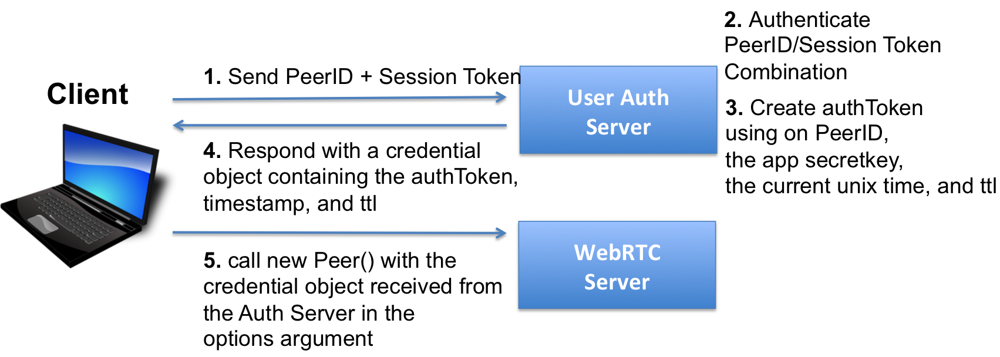

[このドキュメントの日本語版](./README.jp.md)

# SkyWay Peer Authentication Samples

This repository contains samples that show how to calculate the credentials for authenticating peers.

## Overall flow



1. Send the client's peerId and session token or password to your Authentication server
2. Authenticate the peerId and session token using your Authentication server
3. Create an authToken following the directions in [authToken](#authtoken)
4. Send the credential object, (authToken, timestamp and token ttl,) back to the client
5. Connect to the SkyWay Server as normal using `new Peer()`, passing the credential as shown in [Example using JavaScript with jQuery](#example-using-javascript-with-jquery)

**Warning: Start again from step 1 and create a new authToken every time you call `new Peer()`.** If a client disconnected uncleanly due to network or other problems, the same peerId and authToken combination cannot be used for some time. It is possible to connect again immediately if a new authToken is used.

## Credential format

The credential passed to `new Peer()` is a Javascript object in the following format.

```javascript
{
  authToken: <string>,
  ttl: <number>,
  timestamp: <number>
}
```

### ttl

The ttl is a value given in seconds between 600 (10 minutes) and 90000 (25 hours). After the ttl runs out, all connections to SkyWay servers are disconnected.

### timestamp

The timestamp is the current unix time (seconds).

**Warning: A timestamp in the future will be rejected.**

### authToken

The authentication token for the peerId, calculated from the current `peerId`, the current `timestamp`, the `ttl`, and the app `secretKey`.
You can find the secret key for your app on the developer's dashboard.

It is calculated using the HMAC-SHA256 algorithm on the string `$timestamp:$ttl:$peerId`, with the secret key for the app. 

The final value MUST be in base64 string format.

## Using the samples

Look at the README in each individual language folder for information on how to run the server.

Before you run the sample you should set the `secretKey` variable in the marked `Config section` with the one for your app.
You can find the secret key for your app on the developer's dashboard.

Optionally, you can implement the `checkSessionToken()` or `check_session_token()` functions to check if the session token passed to the server is valid.
The authentication with the session token is not implemented in the samples and always returns true.
In the samples, we use a session token but it could also be a password check to authenticate the user.

POST a request to the server at http://localhost:8080/authenticate. 
The request must contain the `peerId` and `sessionToken` parameters, sent as `application/x-www-form-urlencoded`.
See [Example using JavaScript with jQuery](#example-using-javascript-with-jquery)  below, or run the sample client described in [Sample Client Script](#sample-client-script). 

### Example using JavaScript with jQuery

```javascript
$.post('http://localhost:8080/authenticate',
  {
    peerId: 'TestPeerID',
    sessionToken: '4CXS0f19nvMJBYK05o3toTWtZF5Lfd2t6Ikr2lID'
  }, function(credential) {
    var peer = new Peer('TestPeerID', {
      apikey: apikey,
      credential: credential
    });
    
    peer.on('open', function() {
      // ...
    });
  }).fail(function() {
    alert('Peer Authentication Failed');
  });
```

### Sample Client Script

There is a sample HTML/Javascript implementation of client authentication in the `client/` directory.

You can serve the html file using:
```bash
$ cd client
$ python -m SimpleHTTPServer 8000
```

Access http://localhost:8000 and click the `Get Credential` button while one of the sample servers is running.
